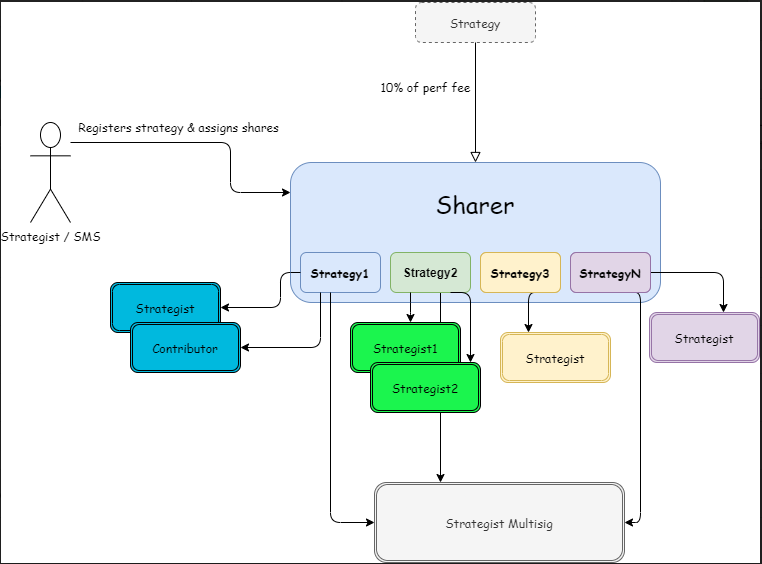

# Sharer Contract
## Overviews
In almost every case, a Yearn strategy is deployed with the help of others. The Yearn Sharer contract is a contract designed to split a strategists' performance fees among other strategists and contributors who have helped them get the strategy deployed.  

## How it works
A strategist can register their strategy by calling `.setContributors()` on the Sharer contract and passing in:
1. The strategy address
1. Array of contributor addresses
1. Array of shares to assign to each contributer

The Strategist must then set the Sharer contract as the rewards address in their strategy. Once strategist rewards begin to be earned by the strategy, they can be claimed and evenly distributed to shareholders at any time by calling `.distribute()` and passing in:  
1. Vault token address
1. Strategy address

## Reccommended Values
While a strategist gets ultimate say in how rewards are split up, it is strongly reccommended to give back 1/3 to the strategist multisig (to cover things like code reviews and guidance), and a portion to others who have may have helped you in your development process.  
The Sharer contract expects 1,000 shares to be distributed among contributors. If the sum of shares supplied is < 1,000, the remainder will automatically be sent to the strategist multisig.