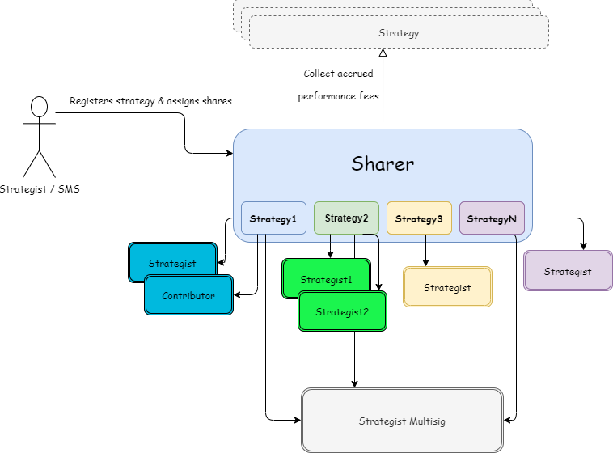

# Sharer Contract
## Overviews
In almost every case, a Yearn strategy is deployed with the help of others. The Yearn Sharer contract is a contract designed to split a strategists' performance fees among other strategists and contributors who have helped them get the strategy deployed.  

## How it works
There is only a single Sharer contract deployment, and it is designed to be capable of handling reward distribution for all Yearn strategies.

### Setup
A strategist can register their strategy by calling `.setContributors()` on the Sharer contract and passing in:
1. The strategy address
1. Array of contributor addresses
1. Array of shares to assign to each contributer  

After initial configuration, the Strategist must then set the Sharer contract as the `rewards` address in their strategy. 

### Usage
Once strategist rewards begin to be earned by the strategy, they can be claimed and evenly distributed to shareholders at any time by calling `.distribute()` and passing in:  
1. Vault token address
1. Strategy address

## Shares
The Sharer contract splits rewards up into 1,000 shares to be distributed among contributors. So a strategist who, for example, wants to split rewards evenly with another strategist should assign 500 shares to themselves and 500 to the other strategist.  
If the sum of assigned shares is less 1,000, the remainder will automatically be sent to the strategist multisig whenever `.distribute()` is called.

## Recommended Share Allocation
While each strategist has ultimate say in how their cut of the performance fee is split up, it is strongly reccommended to:
- Allocate 1/3 of total shares to the strategist multisig to cover things like code reviews, guidance, and incentivization of tooling
- Allocate additional amounts of shares to others who have may have helped in the strategy's development process.

